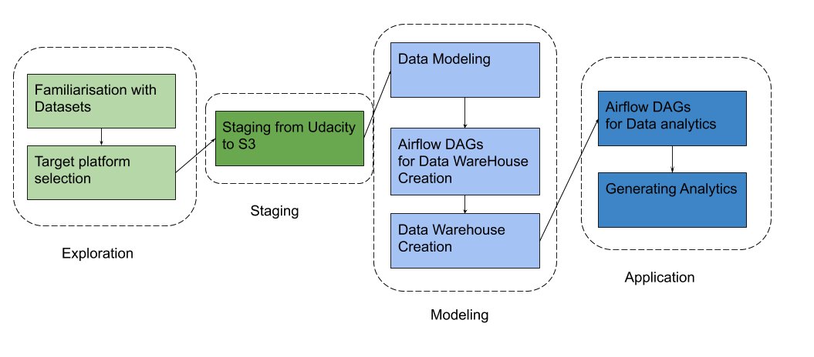

# Udactiy Data Engineering Capstoneutilise

## Overiew

This Capstone project is for the Udacity data engineering nanodegree. The purpose is to combine skills and tools presented during the program to build a Data Warehouse for further data analysis.

My solution is building a Data Warehouse with S3 and Amazon EMR platform. Applications of Ad hoc queries, standard reports and analytic Apps can analyze immigration data to generate immigration report, like:

- original countries of visitors to US
- age distribution
- numbers of different visa types
- the popular landing ports and relations to city's population and temperature
- the popular month of visiting US and the trends with time
- the popular airlines.

The main dataset includes  I94 immigration data from US National Tourism and Trade Office; every visitor to US are required to fill an I94 arrival/departure record, and supplementary datasets include data on airport codes, U.S. city demographics, and temperature data. This project will extract data from four data sources, transform and load them into a star schema model through Spark on Amazon EMR. The end solution is one fact table of immigration records and four dimentional tables: persons, cities, dates and transport. The original data sources are already stored on S3. Only Apache Spark will be used and tables will be saved in parquet format on S3, so there is no database needed here.

## Steps

The project contains four phases, 8 steps totally.

### Phase one:

​	**Fmiliarisation with Datasets**: The i94 data is more than 5GB, but there is a sample csv file,

There are one fact table imm_facts and four dimensional tables. The fact table includes most of items from i94 immigration records and keys linked to dimensional tables. Dimensioanl tables includes persons, cities, dates and transport. Fact table and persons table can be joined to analyze the components of visitors to US, age distribution, visa types. Fact table and cities can be used to find the popular landing ports and relations to city's population, temperature. Joining fact table and dates table can discover the popular month of visiting US and the trends with time. Dimensional table transport and fact table help to analyze the popular airlines.

The main dataset will include data on immigration to the United States, and supplementary datasets will include data on airport codes, U.S. city demographics, and temperature data. You're also welcome to enrich the project with additional data if you'd like to set your project apart.